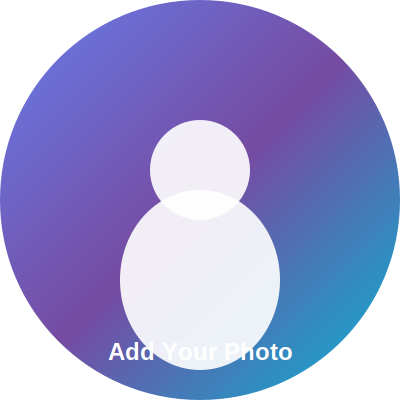

# 📸 Profile Image Guide

Your portfolio now includes a **professional profile image section** on both sides with animated borders!

## 🎯 Quick Setup

### Step 1: Prepare Your Photo

**Requirements:**
- ✅ Professional headshot or portrait
- ✅ Square format (1:1 ratio)
- ✅ Minimum size: 700x700px
- ✅ Recommended: 1000x1000px or 1200x1200px (for crisp display)
- ✅ Format: JPG, PNG, or WebP
- ✅ File size: Under 500KB (optimize for web)

**Tips for Best Results:**
- Use a clear, well-lit photo
- Neutral or professional background
- Face clearly visible
- Smile naturally
- Business casual or professional attire

### Step 2: Add Your Photo

**Option A: Replace Placeholder (Easiest)**

1. Rename your photo to `profile.jpg` or `profile.png`
2. Place it in the `assets/` folder
3. Open `index.html`
4. Find both instances of:
   ```html
   
   ```
5. Replace with:
   ```html
   
   ```
   (or `profile.png` if using PNG)

**Option B: Keep Any Filename**

1. Add your photo to `assets/` folder (e.g., `my-photo.jpg`)
2. In `index.html`, update the image source:
   ```html
   <!-- Cybersecurity side (around line 62) -->
   
   
   <!-- Developer side (around line 231) -->
   
   ```

## 🎨 Image Features

### Both Sides Include:
- ✨ Animated rotating gradient border
- 🔄 Smooth fade-in animation on page load
- 🎯 Hover effects (scale + glow)
- 📱 Fully responsive sizing
- ⚡ Performance optimized

### Cybersecurity Side (Front)
- **Border Colors**: Cyan → Blue → Green
- **Effect**: Glowing neon border
- **Shadow**: Bright cyan glow on hover
- **Theme**: Dark, tech-focused

### Developer Side (Back)
- **Border Colors**: Purple → Teal → Violet
- **Effect**: Elegant gradient border
- **Shadow**: Soft professional shadow
- **Theme**: Light, modern

## 📐 Image Sizes by Device

- **Desktop**: 350x350px displayed (large, right side)
- **Tablet (992px)**: 280x280px displayed
- **Tablet (768px)**: 250x250px displayed
- **Mobile**: 200px displayed (centered on top)

*Upload larger (1000x1000px) for crisp display on all screens*

## 🎨 Layout Design

Your portfolio uses a **side-by-side hero layout**:
- **Left Side**: Your name, title, and information (text-aligned left)
- **Right Side**: Large profile image with animated gradient border
- **Mobile**: Image appears on top, then info below (centered)
- **Animations**: Text slides in from left, image from right

## 🖼️ Image Optimization

### Online Tools (Free)
1. **TinyPNG/TinyJPG** - https://tinypng.com
   - Compress without quality loss
   - Reduce file size by 50-70%

2. **Squoosh** - https://squoosh.app
   - Google's image optimizer
   - Side-by-side comparison

3. **ImageOptim** (Mac) / **FileOptimizer** (Windows)
   - Desktop apps
   - Batch processing

### Quick Optimization Tips
```bash
# Recommended settings:
- Quality: 85-90%
- Format: JPG for photos
- Size: 800x800px
- File size: < 200KB ideal
```

## 🎭 Different Photos for Each Side (Optional)

Want different images for Cybersecurity vs Developer side?

**In `index.html`:**

```html
<!-- Cybersecurity side (line ~62) -->


<!-- Developer side (line ~231) -->

```

**Ideas:**
- Cybersecurity: More serious/professional look
- Developer: Relaxed/creative vibe
- Or use same photo for consistency ✅

## 🚫 Troubleshooting

### Image Not Showing?

**Check:**
1. ✅ File is in `assets/` folder
2. ✅ Filename matches exactly (case-sensitive!)
3. ✅ Path is correct: `assets/profile.jpg`
4. ✅ File extension is correct (.jpg not .jpeg)
5. ✅ Clear browser cache (Ctrl + Shift + R)

### Image Looks Distorted?

**Solutions:**
- Use square format (1:1 ratio)
- Crop to square before uploading
- Use online crop tool: https://croppola.com

### Image Too Large (Slow Loading)?

**Fix:**
- Compress at https://tinypng.com
- Resize to 800x800px max
- Convert to WebP format (smaller size)

### Image Quality Poor?

**Improve:**
- Upload higher resolution (1000x1000px)
- Use better source photo
- Ensure good lighting in original
- Don't over-compress (keep 85%+ quality)

## 🎯 Professional Photo Tips

### Lighting
- Natural light works best
- Avoid harsh shadows
- Face the light source
- Soft, diffused light ideal

### Background
- Plain solid color
- Slightly blurred background
- Professional setting
- Avoid clutter

### Composition
- Face in center
- Look at camera
- Shoulders visible
- Slight smile

### Clothing
- Business casual or professional
- Solid colors work well
- Avoid busy patterns
- Match your industry

## 🔄 Updating Your Photo Later

1. Replace file in `assets/` folder
2. Keep same filename OR update HTML
3. Commit and push to GitHub
4. Clear cache to see changes

## ❌ Removing Profile Image (Optional)

Don't want a profile photo? Remove these sections:

**In `index.html`**, delete:
```html
<!-- Profile Image -->
<div class="profile-image-container cyber-profile">
    <div class="profile-image-wrapper">
        
        <div class="profile-border"></div>
    </div>
</div>
```

Do this for **both** sides (cybersecurity and developer).

## 📱 Test Your Image

After adding:
1. Open `index.html` in browser
2. Check both sides (flip the card)
3. Test hover effect (desktop)
4. Resize window to test mobile
5. Verify it looks professional

## 🎨 Advanced Customization

### Change Border Colors

**In `style.css`, find** (around line 380):

```css
/* Cybersecurity border */
.cyber-profile .profile-border {
    background: linear-gradient(45deg, 
        var(--cyber-primary),     /* Cyan */
        var(--cyber-secondary),   /* Blue */
        var(--cyber-accent)       /* Green */
    );
}

/* Developer border */
.dev-profile .profile-border {
    background: linear-gradient(45deg, 
        var(--dev-primary),       /* Purple */
        var(--dev-secondary),     /* Teal */
        var(--dev-accent)         /* Violet */
    );
}
```

### Change Image Size

**In `style.css`, find** (around line 391):

```css
.profile-image-wrapper {
    width: 350px;   /* Change this (desktop size) */
    height: 350px;  /* And this */
}
```

Then update responsive sizes in media queries:
- Around line 925: 280px (tablets)
- Around line 958: 250px (small tablets/mobile)
- Around line 1007: 200px (phones)

### Change Border Thickness

**In `style.css`:**

```css
.profile-border {
    top: -8px;    /* Increase for thicker border */
    left: -8px;
    right: -8px;
    bottom: -8px;
}
```

### Change Animation Speed

**In `style.css`:**

```css
.cyber-profile .profile-border {
    animation: rotateBorder 3s linear infinite;  /* Change 3s */
}
```

## 📊 Image Specifications Summary

| Property | Value |
|----------|-------|
| **Dimensions** | 1000x1000px (or larger) |
| **Aspect Ratio** | 1:1 (square) |
| **Format** | JPG, PNG, or WebP |
| **File Size** | < 300KB ideal |
| **Quality** | 85-90% |
| **Display Size** | 350px (desktop), responsive on mobile |
| **Location** | `assets/` folder |
| **Layout** | Right side of hero, text on left |

## 🎁 Bonus: Avatar Generators

Don't have a photo? Use these:

1. **Bitmoji** - https://bitmoji.com
   - Cartoon avatar
   - Fun and recognizable

2. **Avataaars** - https://getavataaars.com
   - Customizable illustrations
   - Professional looking

3. **Personas** - https://personas.draftbit.com
   - Gradient avatars
   - Abstract and modern

4. **UI Faces** - https://uifaces.co
   - AI-generated faces
   - Realistic but not real

## ✅ Final Checklist

Before deploying:
- [ ] Photo is professional quality
- [ ] Image is optimized (< 200KB)
- [ ] Filename matches HTML reference
- [ ] File is in `assets/` folder
- [ ] Tested on both sides
- [ ] Looks good on mobile
- [ ] Border animation works
- [ ] Hover effect working

---

**🎉 Your portfolio now has a stunning profile image!**

The animated gradient border creates a memorable first impression that matches your dual cybersecurity/developer identity.

---

*Need help? See README.md for full documentation.*
*Questions? Check TROUBLESHOOTING section above.*

